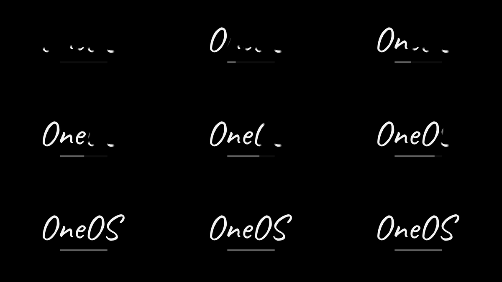

# 开机动画原理



目标：黑底、白色连笔 "OneOS" 逐字写出、下方一条细进度条，苹果 Hello 动画的感觉。

## 参考

- [InkTrail](https://github.com/GXeLla/InkTrail)（MIT）：把任意文字变成自带动画 SVG，
  核心是 **保留字体的填充字形，用一个粗描边遮罩沿字形轮廓逐步显露**，
  所以看起来像墨水在写字，而不是描轮廓。
- Apple 的 "Hello" 演示用的字体是手写体 **Caveat**，InkTrail 的 Apple-like 预设
  就是 `fontId: caveat`、每字母 0.42s、顺序书写、描边宽度比 0.13、圆头、softness 0.5。
- 我们照这个思路实现了一个不依赖 SVG/浏览器的 **fbdev 播放器**。

## 素材与数据流

```
tools/fonts/Caveat.ttf          # OFL 授权手写字体（含 OFL-Caveat.txt）
        │  fontTools (TrueType 轮廓 -> 展平的闭合轮廓)
        ▼
tools/gen-signature.py
        │  文本排版 -> 归一化坐标（y 向下，最长边=1）
        │  每行 "C x y x y ..." 是一条闭合轮廓，G 行分组到字母
        ▼
crates/oneos-splash/src/signature.data
        │  include_str! 编进二进制
        ▼
oneos-splash                    # 每帧把「填充 ∧ 墨迹」画到 /dev/fb0
```

重新生成（换文字/字体/字号）：

```sh
pip install --user fonttools
python3 tools/gen-signature.py --text OneOS --font tools/fonts/Caveat.ttf
cargo build -p oneos-splash
```

## 渲染原理

播放器里有两张掩码：

1. **填充掩码（静态）**：用非零环绕数的扫描线算法把闭合轮廓填成覆盖率图。
   坐标先放大 4 倍超采样，再降采样回屏幕分辨率，得到抗锯齿边缘。
   文字固定不变，所以只算一次。
2. **墨迹掩码（每帧）**：把每条轮廓按"已写弧长"画成一根很粗的圆头笔画
   （宽度 = 字号 × 0.13），边缘按 softness 做柔和衰减。
3. 合成：`像素 = 填充覆盖率 × 墨迹覆盖率 × 白色`——只有"笔走过"的区域才显露字形，
   和 InkTrail 的 SVG mask + `stroke-dashoffset` 是同一个数学。

时间轴（仿其 Apple-like 预设）：

- 每字母 0.5s，字母之间间隔 0.06s，顺序书写（上一个写完再下一个）
- 缓动 `cubic-bezier(0.4, 0, 0.2, 1)`（smooth），用二分法解曲线
- 5 个字母总时长约 2.9s，末尾停留 1s
- 进度条按总时长线性填充

开机时序由 `oneos-splash.service` 控制：`Before=getty.target`（挡住登录），
`ConditionPathExists=/dev/fb0`（纯串口模式自动跳过）。内核命令行加了
`quiet` 和 `vt.global_cursor_default=0`。

## 启动耗时自适应

动画会挡住登录提示，装完整版（约 3.9s）比系统本身启动还慢。播放器因此改成
"按上次启动耗时自动加速"：

```
每次启动                         下次启动
oneos-splash --record   ──►  /var/lib/oneos/boot-history
（multi-user.target 之后运行）    │  保留最近 8 条，取最近 5 条均值 mean
                                  ▼
                     剩余预算 = mean - 当前 uptime
                     播放时长 = clamp(剩余预算 × 0.8, 0.9s, 3.9s)
```

- 记录单元 `oneos-boot-record.service` 是 `WantedBy=multi-user.target` +
  `After=multi-user.target`：systemd 会在 multi-user 达成后启动它，所以记录的是
  "内核启动 → 系统就绪"的总时间，且不会反过来阻塞启动；
  `/run/oneos-boot-recorded` 保证每次开机只记一条
- 播放器在动画开始前（填充掩码算完之后）读 `/proc/uptime` 作为 `now`，
  即当前已经启动到哪一步；预估剩余时间再打 8 折，速度只快不慢
- 结果：启动快的机器动画几秒内放完，慢的机器保持完整时长；
  下限 0.9s（约 4.3 倍速），上限是自然时长 3.9s
- 第一次启动没有历史数据，用 2.0s 的保守默认值

改这些常量在 `crates/oneos-splash/src/main.rs` 顶部：
`FIRST_BOOT_SECS`（首启时长）、`MIN_SECS`（最快）、`SPEED_MARGIN`（折扣）、
`HISTORY_WINDOW`（用几次均值）。手动记录一次当前 uptime 可调试：

```sh
oneos-splash --record        # 追加一条到 /var/lib/oneos/boot-history
cat /var/lib/oneos/boot-history
```

## 本地预览

不用进虚拟机：

```sh
cargo run -p oneos-splash -- --preview /tmp/oneos-splash
# 生成 frame-00.ppm ... frame-08.ppm（P6），可用 ffmpeg/Pillow 合成 GIF 或拼图
```

## 可以改的地方

- 文字：`--text`；字体：`--font`（任意 TTF/OTF，注意授权）
- 时长、颜色、描边比例、softness、进度条位置：
  `crates/oneos-splash/src/main.rs` 顶部常量
- 想要真正的"笔锋"（粗细变化）：把生成器改成输出 SVG 轮廓 + 变宽度，
  或按 InkTrail 的思路在遮罩上叠加压力曲线
